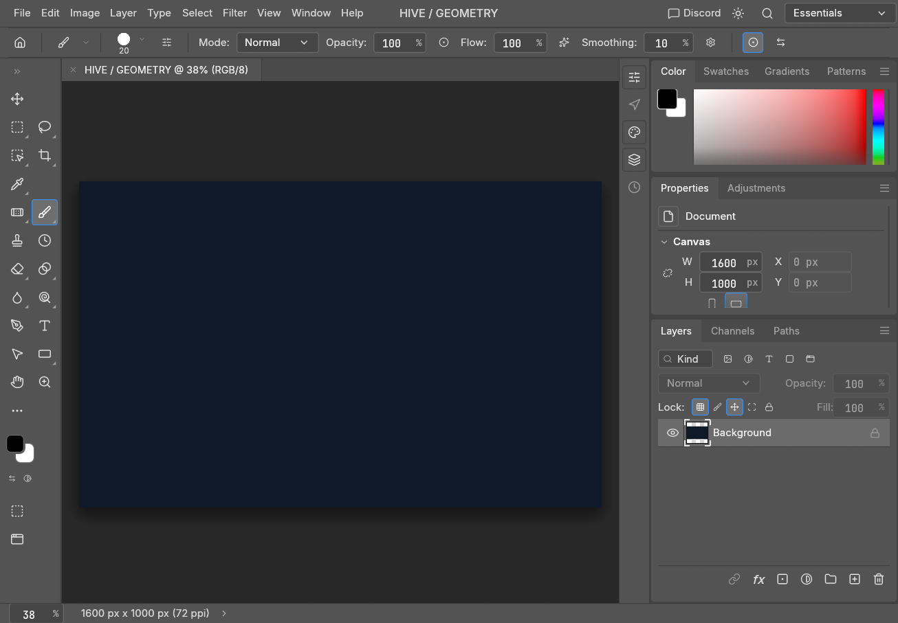
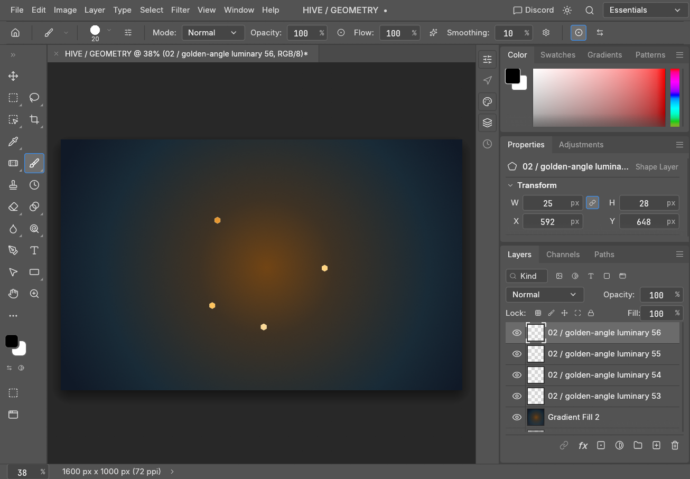
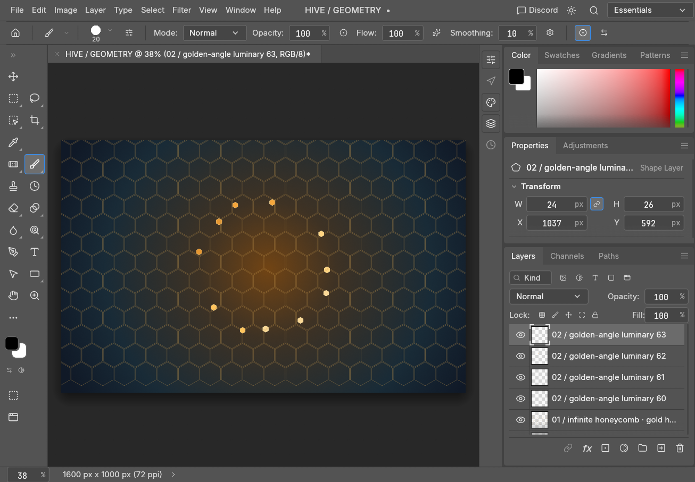
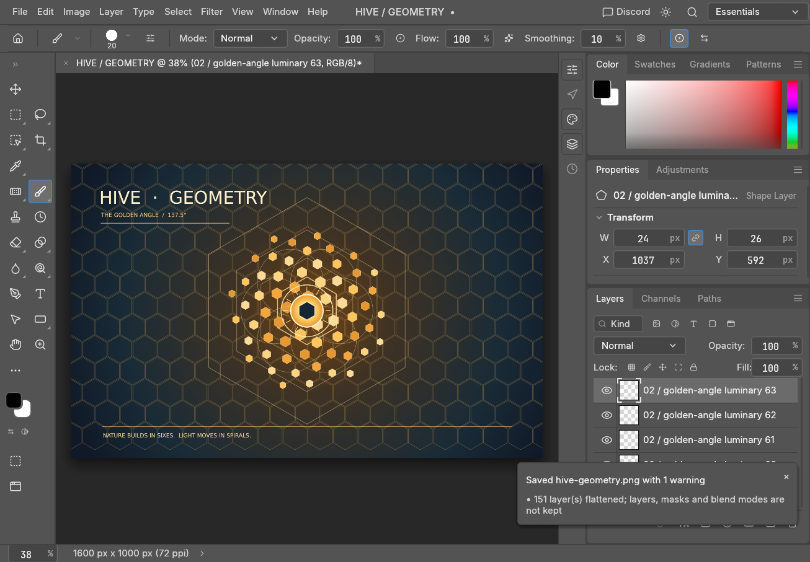
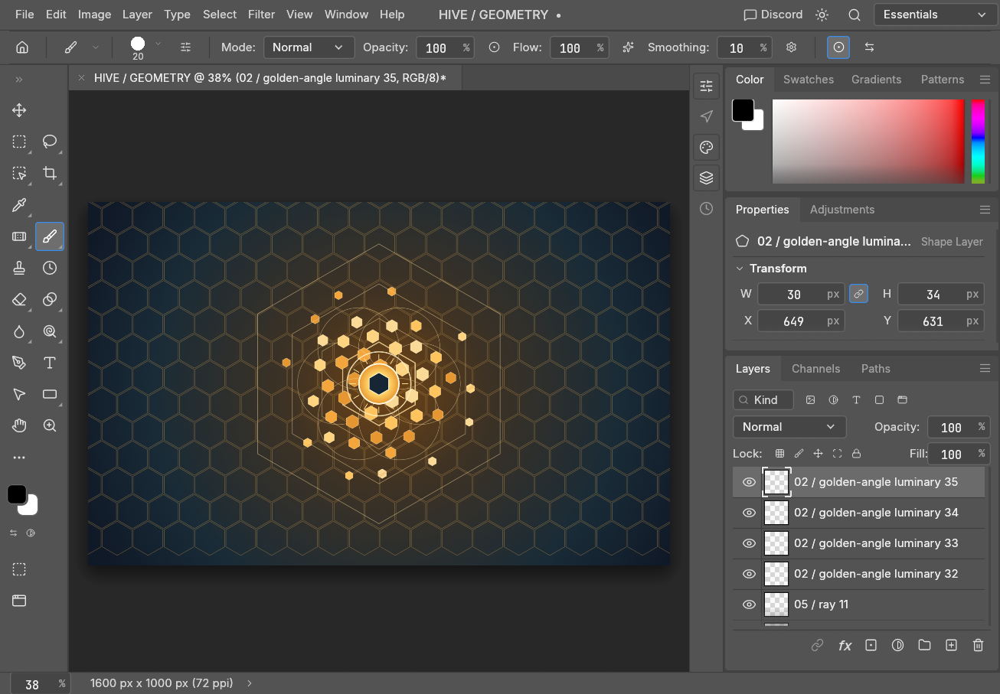
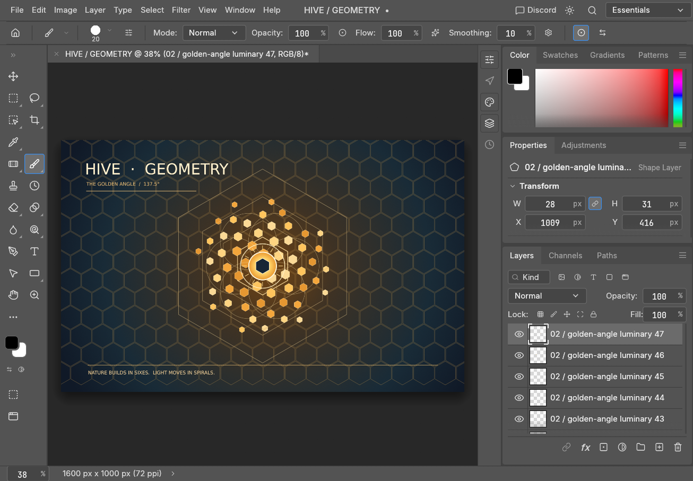

# hive-photocraft

An agent can edit a running PhotoCraft document through hive's authenticated `photocraft` control tool.


## What it looks like

The [full run](docs/showcase/README.md) built this image in stages. Each frame is a screenshot from the PhotoCraft control session.

| Stage | Control call and result |
|---|---|
|  | `ui.screenshot`: the starting canvas before the composition. |
|  | `engine.execute` with `gradient.fill.create`, then `ui.screenshot`: a radial background. |
|  | `engine.execute` with `shape.create`, then `ui.screenshot`: a compound honeycomb path. |
|  | Repeated `engine.execute` with `shape.create`, then `ui.screenshot`: golden-angle lights. |
|  | `engine.execute` with `shape.create`, then `ui.screenshot`: hexagon frames, circles and sun. |
|  | `engine.execute` with `type.create` and `shape.create`, then `ui.screenshot`: title and rules. |

## Try it

Make the addon available to hive (its manifest is `resources/META-INF/hive-addons/hive-photocraft.edn`). In hive's `config.edn`, configure the addon by its manifest id. Use your own private token path, not a token value:

```clojure
{:addons {"hive.photocraft" {:control-port 7878
                              :token-ref {:scheme :file
                                          :path "/private/path/photocraft-control.token"}}}}
```

Start the desktop app with the **same** port and token file (`photocraft --control 7878 --control-token-file /private/path/photocraft-control.token`). With the addon mounted, ask hive for the current document:

```json
{"command":"control","method":"document.inspect","id":"inspect-1","params":{}}
```

This is a `photocraft` tool call, not a shell command. `command=catalog` lists available methods; `command=doctor` diagnoses the transport. The socket adapter only connects to loopback and authenticates with the token before sending a request. An app and a configured control channel are required for live edits.

## Measured

The pictured PhotoCraft run used an authenticated control channel with a token file (`:token-ref`). The sample setup above uses port **7878**; the checked-in art script records the run's port separately. The six stage screenshots and the final export above are its artifacts. The [run script](dev/art/hive_geometry.clj) records calls and elapsed time in memory, but this showcase does not claim an aggregate count or timing. The existing source-extraction and portability measurements are preserved below under **Measured and not verified**.

## What is available

| Layer | JVM | cljw | cljrs | cljs/node |
|---|---|---|---|---|
| Catalog lookup, validation, auth/request/reply values | yes | yes | yes | yes |
| JSON-lines codec (`hive-photocraft.json`) | yes | yes | yes | yes |
| `photocraft` IAddon tool; catalog/doctor/call/control | yes | no | no | no |
| Injected `ControlTransport` port; test stub and recorder | yes | no | no | no |
| Live control TCP / Rust engine cdylib | TCP yes / cdylib separate | planned | planned | no |

`photocraft` takes `command`: `catalog`, `doctor`, `call`, or `control`. `control` takes a catalogued `method`, optional `id` and `params`. `call` takes `id` (integer or string), `engine_command` (catalog id), and `params` (object). Without a configured transport it returns `:photocraft/unavailable` with the fix. The JVM addon can construct a loopback socket transport from `:control-port` and `:token-ref`. The adapter is not a PhotoCraft CLI process: future cljw uses the program's own control TCP protocol; the cljrs Rust cdylib is documented separately in [native C ABI](docs/native-cabi.md). Every connection must send `auth` before requests. The JVM boundary renders unknown tool commands with hive-help; portable code answers errors as values.

## Repository map

- `resources/hive_photocraft/catalog.edn`: generated source-visible commands and control methods.
- `dev/extract_catalog.clj`: reproducible extractor, run from the repo root in the cider session with `(load-file "dev/extract_catalog.clj")` then `(extract-catalog/-main "/path/to/photocraft")`.
- `src/hive_photocraft/{core,json}.cljc`: pure portable value objects, validation, wire encoding.
- `src/hive_photocraft/{catalog,transport,addon}.clj`: JVM resource, effect port, IAddon boundary.
- `test/hive_photocraft/`: focused test fixtures with injected stub, recorder and fault adapter; no `with-redefs`.
- `dev/hive_photocraft/portability.cljc`: shared 96-check four-runtime contract.
- `dev/verify_portability.sh`: cljw/cljrs/cljs gate; JVM leg optional and normally run in the existing cider session.

## Verify

`clojure -J-Xmx2g -M:test` runs kaocha (cold JVM; do not run while the cider JVM is active). During development in `hive-photocraft-core`'s cider nREPL, run `(clojure.test/run-tests 'hive-photocraft.core-test 'hive-photocraft.addon-test)` and `(hive-photocraft.portability/run-checks)` after loading `dev/hive_photocraft/portability.cljc`. `bash dev/verify_portability.sh cljw cljrs cljs` compiles the node leg with hive-cljs/shadow-cljs tooling. All portable namespaces require only clojure.core, clojure.string and clojure.edn/cljs.reader, not JVM-only dependencies.

## Measured and not verified

At reference commit 47f9306, source extraction finds 271 distinct literal/adjustment command IDs and 28 control methods. The upstream registry includes dynamic definitions that source extraction cannot certify as complete; 124 entries retain a source-file pointer but no extracted params doc. That source-extraction measurement did not test the desktop app or full registry. The later live art session shown above used the authenticated desktop control channel; the separate [native C ABI](docs/native-cabi.md) documents its own build and tests. See [reference surface](docs/reference-surface.md). The portable 96-check contract is run independently on each runtime; it does not claim live PhotoCraft parity.

MIT, 2026 hive-agi. PhotoCraft upstream is MIT OR Apache-2.0 (its own license remains its own).
