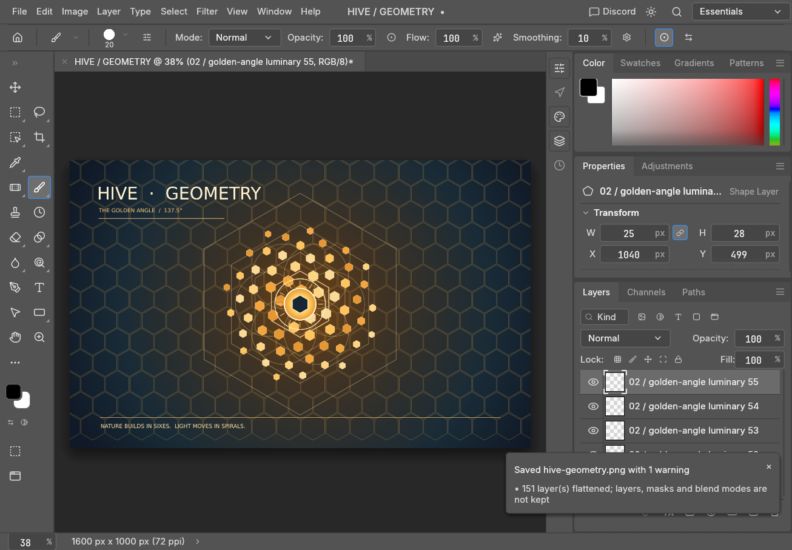

# Hive Geometry in PhotoCraft

This is the image made in a live PhotoCraft control session. [Back to the repo](../../README.md).


## The run

The [art script](../../dev/art/hive_geometry.clj) drives an authenticated socket transport. It sends `engine.execute` with an engine command and parameters, and uses `ui.screenshot` to capture progress. Its port is specific to the recorded run; use your own port and token file when repeating it. The screenshots below are the saved outputs, not mockups.

1. **Start.** `ui.screenshot` captured the initial canvas.

   

2. **Atmosphere.** `engine.execute` ran `gradient.fill.create` with a radial gradient, followed by `ui.screenshot`.

   

3. **Lattice.** `engine.execute` ran `shape.create` for one compound path of honeycomb cells, followed by `ui.screenshot`. The script builds the hexagonal paths from `honey-cells` and `hex`.

   

4. **Spiral.** Repeated `engine.execute` calls ran `shape.create` for 64 lights positioned by the golden angle. `ui.screenshot` captured the result.

   

5. **Geometry.** `engine.execute` ran `shape.create` for concentric hexagon frames, six circular orbits, a halo, a sun and rays. `ui.screenshot` captured the construction.

   

6. **Type and save.** `engine.execute` ran `type.create` for the title, subtitle and footer and `shape.create` for fine rules. After `ui.screenshot`, the script sent `app.save` for the `.pcraft` document and PNG, then `document.inspect`.

   

The app window was captured too:



## Repeat with your own document

The addon id in `resources/META-INF/hive-addons/hive-photocraft.edn` is `hive.photocraft`. Mount the addon and configure its control port and a secret reference in hive's `config.edn`:

```clojure
{:addons {"hive.photocraft" {:control-port 7878
                              :token-ref {:scheme :file
                                          :path "/private/path/photocraft-control.token"}}}}
```

Run `photocraft --control 7878 --control-token-file /private/path/photocraft-control.token`, using the same port and path. Then call the hive `photocraft` tool:

```json
{"command":"control","method":"document.inspect","id":"inspect-1","params":{}}
```

For a catalogued engine command, the tool also accepts `{"command":"call","engine_command":"shape.create","id":"shape-1","params":{...}}`; supply the required parameters from `command=catalog` before calling it. The socket adapter uses loopback, reads the token reference at the boundary and authenticates before a request. Keep the token file private. No desktop process is launched by the addon.

## Numbers and scope

The example configuration uses port **7878**; the art script records a different port for this run. The script loops over **64** golden-angle lights and **6** circular orbits. The exported PNG measures **1600 × 1000** pixels (checked from the artifact), and the captured window is **1306 × 907** pixels. Its `measurements` atom accumulates calls and milliseconds, but no aggregate from the live run is published here. The source-extracted catalog records **271** distinct literal/adjustment engine command IDs and **28** control methods at reference commit `47f9306`; this is not a claim of complete upstream registry coverage. See [reference surface](../reference-surface.md).

## Where this fits

PhotoCraft and VectorCraft are the art side of the four-craft showcase: this PhotoCraft session composed a raster artwork with vector shapes, gradients and type, while VectorCraft drew its own golden comb through its control channel. The fabrication side is a separate path: Blender produced a roughly 130 mm slab STL, then hive-bambu sliced it with BambuStudio profiles. These are parallel examples of agents controlling creative tools through hive, not a claim that this PhotoCraft PNG was sent to the slicer or that the VectorCraft artwork was imported here.
